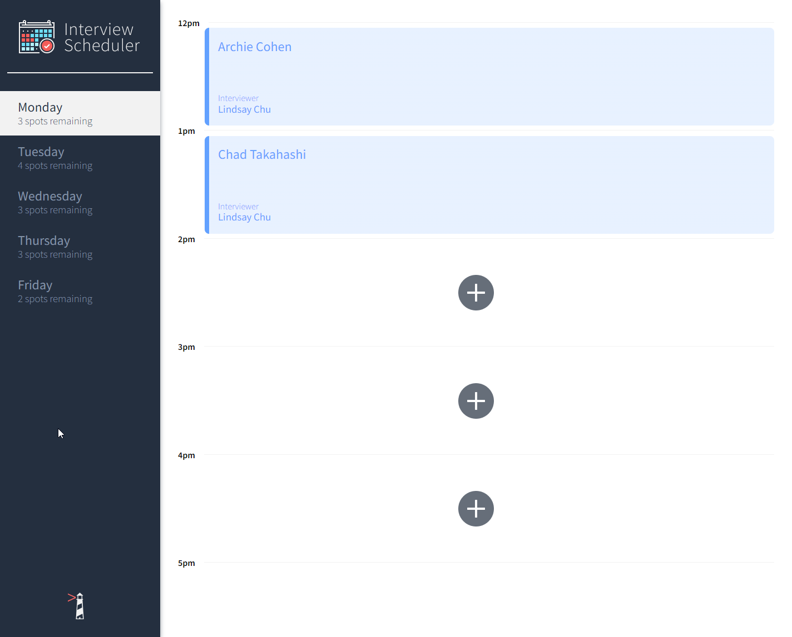
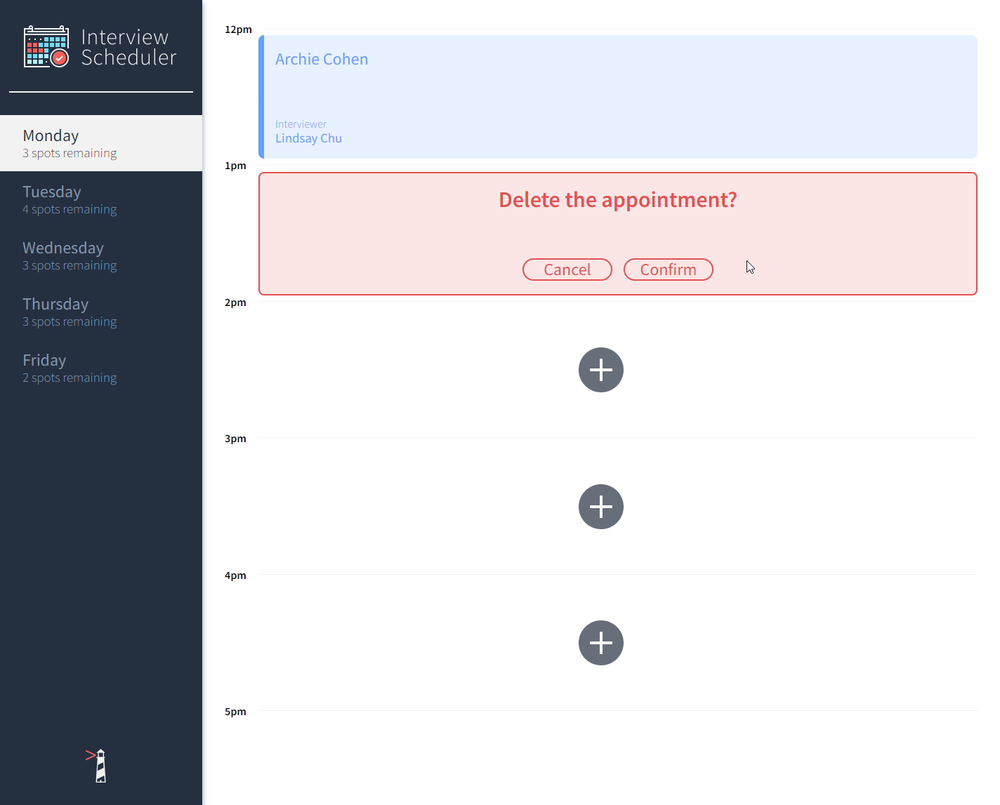

# Interview Scheduler

Interview Scheduler is an application that allows the user to book/edit/cancel appointments with a user input for student name, and a list of interviewers to select from.

## Setup

Install dependencies with `npm install`.

## Running Webpack Development Server

```sh
npm start
```

## Running Jest Test Framework

```sh
npm test
```

## Running Storybook Visual Testbed

```sh
npm run storybook
```

## Installing API server
The application requires an API server to be installed and run parellel to the application.
- Fork and clone https://github.com/lighthouse-labs/scheduler-api
- Follow the instructions in the README
- Install all dependencies with `npm install`
- Run the API server with `npm start`

## Project Dependencies
    Axios
    Classnames
    Normalize.css
    React
    React-dom
    React-scripts
    Babel/core
    Storybook/addon-actions
    Storybook/addon-backgrounds
    Storybook/addon-links
    Storybook/addons
    Storybook/react
    Testing-library/jest-dom
    Testing-library/react
    Testing-library/react-hooks
    Babel-loader
    Node-sass
    Prop-types
    React-test-renderer


## Screenshots

Homepage


Creating/Editing Appointment


Deleting Appointment
